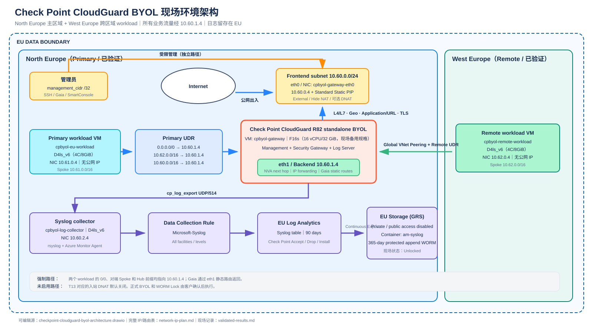

# Check Point CloudGuard Azure BYOL 独立演示

本目录使用本地保存的 Check Point 官方 Terraform 模块 `v1.3.2`，默认从
Azure Marketplace 部署 `standalone` CloudGuard，也可显式传入 generalized
managed image 或 Azure Compute Gallery image ID。管理服务器、安全网关和
日志服务器运行在同一台 Azure VM 上，Marketplace 计划为 `mgmt-byol`。
许可证不写入 Terraform 配置或状态文件。模块版本、`commit`、许可证和更新方法见
[Terraform 模块本地副本](infra/vendor/README.md)。

这是一个**非生产 Demo**。默认只部署基础设施并配置 Gaia 路由、管理员登录和
Log Exporter，不调用 Check Point Management API 创建对象、规则或安装策略。
如需复现原有 Access Control、HTTPS Inspection 和 Geo-IP 自动化，显式设置
`skip_policy_configuration = false`。

## Demo 需求

| 需求 | Demo 中的检查目标 |
| --- | --- |
| L4/L7 流量控制 | 可选自动化模式按五元组、Domain、URL 和 Application object 创建 Access Rule；对指定 HTTPS 流量执行解密 |
| 跨境数据控制 | 可选自动化模式使用 Check Point Geo Updatable Objects 按国家/地区拒绝入站和出站流量 |
| 南北向和东西向覆盖 | 互联网出站、两个 Azure VNet 之间的跨区域流量都以 `10.60.1.4` 为 NVA 下一跳 |
| 日志审计 | Check Point 日志写入 EU Log Analytics，并持续导出到 EU GRS Storage |
| 防篡改留存 | `am-syslog` 配置 protected append Immutability Policy；客户确认后再执行不可逆锁定 |
| Azure Marketplace BYOL | 默认使用 `publisher=checkpoint`、R82/R82.10 `offer` 和 `plan=mgmt-byol`；Marketplace 派生 custom image 继续携带同一 plan |

## 阅读对象与目标

本文面向能阅读 Bash、Terraform 和 Azure CLI 输出的工程师，也供架构师判断
方案边界。读者可以按文档完成以下操作：

1. 在显式指定的 Azure 订阅中部署 Check Point BYOL 演示环境。
2. 解释两块 Gateway NIC、两个 Spoke UDR、Gaia 静态路由和日志路径的分工。
3. 用现场命令检查 L4/L7、Geo-IP、HTTPS Inspection、跨区域流量和 WORM 状态。

## 适用范围与限制

| 项目 | 当前状态 | 会影响什么决定 |
| --- | --- | --- |
| Check Point 拓扑 | 单实例 `standalone` | 适合演示和概念验证（POC）；生产环境需要 High Availability 或 VMSS |
| Check Point 许可 | Azure Marketplace BYOL；现场验证使用 15 天产品试用 | 客户部署前需要准备正式 BYOL，并确认所需 Software Blade 授权功能 |
| Check Point VM | `mgmt-byol` 镜像为 Hyper-V Gen1 | 不能使用只支持 Gen2 的 Dv6；默认选择 `Standard_D8s_v5` |
| Azure VM 容量 | 随订阅、区域和时间变化 | `SkuNotAvailable` 时需要更换区域或兼容规格 |
| 跨区域路径 | Azure Global VNet Peering | 证明私网流量可强制经过防火墙，不代表 ExpressRoute 电路已验证 |
| HTTPS Inspection | 演示 CA | 生产环境需要企业 CA、解密例外、隐私评审和终端证书分发 |
| 日志传输 | `cp_log_export` 使用 UDP/514 | 生产环境需要根据威胁模型评估 TCP/TLS |
| Write Once, Read Many（WORM） | 默认 `Unlocked`，365 天 | 只有执行不可逆锁定后才是 Locked WORM |
| 成本 | Check Point VM、3 台 Linux VM、Public IP、Log Analytics 和 GRS Storage 计费 | 部署前按客户区域和保留期估算费用 |

## 现场验证环境架构

[](docs/checkpoint-cloudguard-byol-architecture.drawio)

> 图 1 · 两个工作负载子网的默认路由、对端 Spoke 前缀和 Hub 前缀都指向
> `10.60.1.4`。Azure Global VNet Peering 提供跨区域私网连接，Check Point
> 执行访问控制、HTTPS Inspection 和日志记录。

点击架构图可打开 draw.io 源文件。VM、NIC、用户定义路由（UDR）、Gaia 静态路由、
Azure Global VNet Peering 和网络安全组（NSG）的字段见
[网络与 IP 规划](docs/network-ip-plan.md)。

2026-08-27 的现场环境以 **North Europe** 为主区域：

- Hub VNet `10.60.0.0/16` 包含 Check Point `eth0 10.60.0.4`、
  `eth1 10.60.1.4` 和日志收集 VM `10.60.2.4`。
- 主工作负载 `10.61.0.4` 位于 North Europe；远端工作负载
  `10.62.0.4` 位于 West Europe。
- 两个工作负载的默认路由、对端 Spoke 和 Hub 前缀都指向
  `VirtualAppliance 10.60.1.4`；两个 Spoke 不直接 Peering。
- Check Point 使用 `Standard_F16s`（16 vCPU/32 GiB，作为容量备用规格），
  其余 VM 使用 `Standard_D4ls_v6`（4 vCPU/8 GiB）。
- 日志从 Check Point 发送到 `rsyslog` 收集 VM，再由 Azure Monitor Agent
  写入 EU Log Analytics，最后持续导出到私有 GRS Storage 容器 `am-syslog`。

## 需求覆盖

| 原始要求 | 本演示 |
| --- | --- |
| 五元组、域名、URL、应用、TLS 解密 | Check Point Access Control、Application Control/URL Filtering、HTTPS Inspection Outbound CA 和 Inspect layer。 |
| Geo-IP 跨境阻断 | 脚本从 Check Point Updatable Objects Repository 精确查找并导入国家对象，创建入站和出站 `Drop` 规则。 |
| 南北向和东西向 | 两个 EU 区域的 Spoke 都以 `10.60.1.4` 为默认路由和对端前缀下一跳；可选 DNAT 只接受指定来源 CIDR。 |
| EU 审计和防篡改长期留存 | Check Point Log Exporter → 日志收集 VM/Azure Monitor Agent → EU Log Analytics → 同区域 GRS Storage；`am-syslog` 配置可锁定的 WORM。 |
| Azure Marketplace BYOL | `publisher=checkpoint`、R82/R82.10 `offer`、`plan=mgmt-byol`。 |

需求、配置和证据的对应关系见 [需求与检查条件](REQUIREMENTS.md)、
[技术要求映射](docs/requirement-mapping.md)、[网络与 IP 规划](docs/network-ip-plan.md)、
[CloudGuard 镜像导出与创建](docs/cloudguard-image-export.md)、
[可选：从本地 tar.gz 发布 Azure Compute Gallery 镜像](docs/upload-vhd-to-compute-gallery.md)、
[R81 无 Plan 镜像端到端测试与操作](docs/r81-image-e2e-test-and-operations.md)、
[R82 有 Plan 镜像端到端测试与操作](docs/r82-image-e2e-test-and-operations.md)、
[现场验证记录](docs/validated-results.md) 和 [draw.io 架构图说明](docs/drawio-architecture.md)。

## 前置条件

- Terraform `>= 1.9`、Azure CLI、`jq`、OpenSSL、Python 3。
- 目标 Azure 订阅的 Contributor 权限，以及接受 Marketplace 条款的权限。即使使用 Marketplace 派生 custom image，目标订阅仍须接受同一条款。订阅的商务市场必须允许购买 Check Point `check-point-cg-r82`/`check-point-cg-r8210` Offer；该 Offer 不向 `CN` 商务市场销售。
- 交互部署默认复用 `az login`；CI 可选使用完整的 Service Principal（tenant/client/secret 三项缺一不可）。
- Check Point BYOL entitlement。只有设置 `skip_policy_configuration = false` 时才需要相应的 Application Control、URL Filtering 或 HTTPS Inspection entitlement。
- Gaia `admin` 强密码。SSH 公钥由脚本自动生成或由用户提供；`management_cidrs` 可选，省略时允许所有 IPv4 来源。

> **敏感文件**
>
> 不要提交 client secret、Gaia `admin` 密码、SIC key、私钥、Terraform state 或真实
> `tfvars`。VM bootstrap 参数会进入 Terraform state；生产环境应使用加密、
> 受 RBAC 和锁保护的远程 backend。

## 默认 VM 规格

| 角色 | 默认 SKU | 规格 | 兼容性 |
| --- | --- | --- | --- |
| Check Point standalone | `Standard_D8s_v5` | 8 vCPU / 32 GiB | 当前 `mgmt-byol` image 为 Hyper-V Gen1；使用支持 Gen1 的 Dv5 |
| 主工作负载 | `Standard_D4ls_v6` | 4 vCPU / 8 GiB | Ubuntu 24.04 Gen2 |
| 远端工作负载 | `Standard_D4ls_v6` | 4 vCPU / 8 GiB | Ubuntu 24.04 Gen2 |
| 日志收集 VM | `Standard_D4ls_v6` | 4 vCPU / 8 GiB | Ubuntu 24.04 Gen2 |

Azure Dv6 只支持 Gen2，因此不能把当前 Gen1 Check Point standalone image 放到 `Standard_D8s_v6`。如果 Check Point 后续提供受支持的 Gen2 standalone image，再同步修改 image generation、module 和 SKU。

VM SKU catalog 中存在某个 SKU，不代表当前订阅和区域此刻有容量。若 Azure 在 `apply`
返回 `SkuNotAvailable`，优先换区域；也可使用 Check Point module 支持且保持
32 GiB 内存的 `Standard_F16s`（16 vCPU/32 GiB）。2026-08-27 的现场环境使用
这个备用规格，因为该订阅在 West Europe 和 North Europe 都无法分配
`Standard_D8s_v5`。

## 部署步骤

### 1. 登录并选择客户订阅

```bash
az login
az account list --output table
```

无需修改 Azure CLI 的全局默认订阅。后续脚本对每条 Azure CLI 命令都显式使用 tfvars 中的 `subscription_id`。

### 2. 创建本地参数文件

```bash
cd checkpoint-cloudguard-byol-demo
cp configs/demo.tfvars.example configs/demo.tfvars
```

编辑 `configs/demo.tfvars`：

```hcl
subscription_id     = "<SUBSCRIPTION_ID>"
resource_group_name = "rg-checkpoint-byol-demo"
prefix              = "cpbyol"
company_domain      = "example.org"

location        = "westeurope"
remote_location = "northeurope"

checkpoint_admin_password = "<STRONG_GAIA_ADMIN_PASSWORD>"
skip_policy_configuration = true

# 可选；省略时默认允许 0.0.0.0/0。需要限源时再填写：
# management_cidrs = ["203.0.113.10/32", "192.0.2.0/24"]

checkpoint_vm_size = "Standard_D8s_v5"
workload_vm_size   = "Standard_D4ls_v6"
collector_vm_size  = "Standard_D4ls_v6"
```

### 关键参数

| 参数名 | 是否必填 | 类型 | 默认值 | 说明 |
| --- | --- | --- | --- | --- |
| `subscription_id` | 是 | string | 无 | Azure CLI 和 Terraform 明确操作的客户订阅 |
| `checkpoint_admin_password` | 是（部署脚本） | string | `""` | 内置 Gaia `admin` 的 Console 和 CLI/Portal 密码；脚本本地生成 SHA-512 salted hash，SSH 仍只使用公钥 |
| `skip_policy_configuration` | 否 | bool | `true` | 不调用 Management API 创建对象/规则或安装策略；Gaia 路由、管理来源和 Log Exporter 仍会配置 |
| `management_cidrs` | 否 | list(string) | `["0.0.0.0/0"]` | 允许 SSH、Gaia Portal 和 SmartConsole 的来源；需要限源时首项填写部署执行器 |
| `company_domain` | 否 | string | `example.org` | 演示 HTTPS Inspection CA 的 `issued-by`；可填写客户批准的公司域名 |
| `location` | 否 | string | `westeurope` | Hub、Check Point、主工作负载和日志资源所在区域 |
| `remote_location` | 否 | string | `northeurope` | 远端工作负载所在区域，必须与 `location` 不同 |
| `checkpoint_os_version` | 否 | string | `R82` | Gaia 版本；`R81` 仅允许与无 Plan 自定义镜像一起使用 |
| `checkpoint_image_id` | 否 | string | `""` | generalized managed image、Compute Gallery image definition 或 version ID；空值使用 Marketplace |
| `checkpoint_image_requires_plan` | 否 | bool | `true` | 自定义镜像是否需要 Check Point Marketplace plan；仅对非空 `checkpoint_image_id` 生效 |
| `checkpoint_vm_size` | 否 | string | `Standard_D8s_v5` | Check Point VM 规格；受镜像代际和实时容量限制 |
| `workload_vm_size` | 否 | string | `Standard_D4ls_v6` | 两台工作负载 VM 的规格 |
| `collector_vm_size` | 否 | string | `Standard_D4ls_v6` | 日志收集 VM 的规格 |
| `blocked_countries` | 否 | list(string) | `["China"]` | Check Point Repository 中的英文国家名 |
| `enable_tls_inspection` | 否 | bool | `true` | 仅在 `skip_policy_configuration=false` 时使用；R81 未完成 SmartConsole bootstrap 时必须为 `false` |
| `r81_tls_manually_configured` | 否 | bool | `false` | R81 CA、Gateway setting、layer/rule 是否已通过 SmartConsole 配置 |

不同客户只需修改 `tfvars` 中的订阅、`admin` 密码、网络、命名和可选策略参数，不需要修改 Terraform 源码。

### 迁移旧版 tfvars

脚本会创建新文件且拒绝覆盖源文件或已有目标。它把旧的 `management_cidr` 和
`ssh_source_cidrs` 合并、去重为 `management_cidrs`，并补充当前版本新增的密码和
策略跳过参数：

```bash
./scripts/migrate-tfvars.sh configs/old-demo.tfvars configs/demo.tfvars
```

省略第二个参数时输出为 `configs/old-demo.latest.tfvars`。迁移后先把
`checkpoint_admin_password = "REPLACE_ME"` 改成实际密码，再执行部署。

### 使用自定义 Check Point 镜像

同一套 Terraform 和部署脚本支持以下三种模式：

| 镜像模式 | `checkpoint_os_version` | `checkpoint_image_id` | `checkpoint_image_requires_plan` |
| --- | --- | --- | ---: |
| 默认 Azure Global Marketplace R82/R82.10 | `R82`/`R8210` | 空 | 忽略（请求始终带 Plan） |
| Marketplace 派生 R82/R82.10 custom image | 与镜像一致 | 精确 definition/version ID | `true` |
| 已获授权的 R81 无 Plan custom image | `R81` | 精确 definition/version ID | `false`；TLS 默认关闭，或先做 SmartConsole bootstrap |

```hcl
checkpoint_image_id            = "/subscriptions/<SUBSCRIPTION_ID>/resourceGroups/<IMAGE_RG>/providers/Microsoft.Compute/galleries/<GALLERY>/images/<DEFINITION>/versions/<VERSION>"
checkpoint_image_requires_plan = true
```

自定义镜像必须满足以下条件：

1. `Generalized`、Linux、x64、Hyper-V Gen1，且 image version 已复制到 `location`。
2. 从 Marketplace 派生的 Compute Gallery definition 必须保留
   `checkpoint:check-point-cg-r82:mgmt-byol` purchase plan。部署脚本仍会接受
   Marketplace 条款并把 plan 写入 VM；该方式不能绕过客户订阅的 Marketplace
   Policy、条款或商务市场限制。
   本仓库只允许 Check Point 明确提供或授权、且 Gallery definition 的
   `purchasePlan` 为空的 R81 镜像设置
   `checkpoint_image_requires_plan = false`。R82/R82.10 custom image 必须保留原始
   Plan。该开关只控制 VM 请求，不会移除 Azure 已识别的 Marketplace 来源。
   使用无 Plan R81 镜像时，同时设置 `checkpoint_os_version = "R81"`。R81 GA 的
   Management API 1.7 没有自动创建 Outbound Inspection CA 或设置 Gateway HTTPS
   Inspection 的公开命令，因此默认设置 `enable_tls_inspection = false`。也可按
   [策略 runbook](docs/policy-runbook.md) 完成 SmartConsole bootstrap，再设置
   `r81_tls_manually_configured = true` 并通过 `CHECKPOINT_TLS_CA_FILE` 继续安装客户端
   trust 和执行 T07。脚本不使用未支持的 `dbedit`/私有 API。R82/R82.10 继续执行完整
   自动 TLS Inspection 流程。
3. 只能从**未启动的 Marketplace 基础镜像**或 Check Point 明确支持的 generalized
   VHD 创建。不要捕获已配置网关：specialized image 会保留 hostname、用户、
   SSH keys、证书、SIC/管理状态、许可证状态和日志。
4. Azure `waagent -deprovision+user` 只清理 Azure provisioning 和最后一个用户，
   Microsoft 明确说明它不保证清除全部敏感信息；Check Point 没有在上述导出文档中
   提供已初始化 Gaia 网关的完整 generalization/sanitization 流程。
5. 技术上的 VHD 导出和 Gallery 共享不等于获得跨客户分发权。跨租户或跨客户共享前，
   应按服务订单/EULA 向 Check Point 或授权合作伙伴取得书面确认。

参考：
[Check Point VHD 导出](https://sc1.checkpoint.com/documents/IaaS/WebAdminGuides/EN/CP_CloudGuard_Network_for_Azure_HA_Cluster/Content/Topics-Azure-HA/Export_Image.htm)、
[Azure generalized/specialized images](https://learn.microsoft.com/azure/virtual-machines/shared-image-galleries#generalized-and-specialized-images)、
[Marketplace purchase plan](https://learn.microsoft.com/azure/virtual-machines/marketplace-images)。
完整命令和验收步骤见
[CloudGuard Marketplace 镜像导出与 Custom Image Runbook](docs/cloudguard-image-export.md)。
如果已经持有本地 `tar.gz`，可选阅读
[从本地 tar.gz 发布 Azure Compute Gallery 镜像](docs/upload-vhd-to-compute-gallery.md)。
仓库的 `scripts/publish-vhd-image.sh` 可把固定 VHD 归档通过 Managed Disk Direct
Upload 发布为 Gallery version；R81 无 Plan 与 R82 有 Plan 使用同一脚本，只是
R82 额外传入三项 `--plan-*` 参数。

### 3. 准备 SSH key

```bash
unset TF_VAR_admin_ssh_public_key CHECKPOINT_SSH_PRIVATE_KEY
./scripts/preflight.sh --var-file configs/demo.tfvars
ssh-keygen -lf .local/checkpoint-demo-ssh.pub
```

`preflight.sh`、`plan.sh` 或 `deploy.sh` 第一次运行时会自动生成：

- 私钥：`.local/checkpoint-demo-ssh`，权限 `0600`
- 公钥：`.local/checkpoint-demo-ssh.pub`
- Gaia `admin` 密码的 SHA-512 salted hash：`.local/deployment-secrets.env`，权限 `0600`

`.local/` 和这两个具体路径均在 `.gitignore` 中；私钥不会写入 Terraform state，也不能
提交。自动化默认使用该密钥。只有需要外部密钥时才同时设置
`TF_VAR_admin_ssh_public_key` 和匹配的 `CHECKPOINT_SSH_PRIVATE_KEY`。
并行测试多个 Terraform workspace 时，可分别设置 `CHECKPOINT_SSH_PRIVATE_KEY` 和
`CHECKPOINT_DEPLOYMENT_SECRETS_FILE`，避免复用 SSH、SIC 和密码 hash 文件。

Check Point Azure VM 的操作系统 SSH 用户是 `admin`。Azure VM metadata 中可能
显示兼容占位用户名 `notused`，不要用它登录 Gaia。

### 4. 选择认证模式

**本地交互测试（推荐）：**

```bash
unset ARM_TENANT_ID ARM_CLIENT_ID ARM_CLIENT_SECRET
```

Terraform 和 Azure CLI 都使用当前 `az login` 身份，但严格部署到 tfvars 的 `subscription_id`。

**CI / Service Principal：**

```bash
export ARM_TENANT_ID="<TENANT_ID>"
export ARM_CLIENT_ID="<CLIENT_ID>"
export ARM_CLIENT_SECRET="<CLIENT_SECRET>"
```

`subscription_id` 仍写在 `tfvars`；client secret 只通过环境变量传入。

### 5. 只做预检

```bash
./scripts/preflight.sh --var-file configs/demo.tfvars
```

我用这条命令检查以下字段：

- 当前登录身份可以访问 tfvars 指定订阅。
- Check Point Marketplace image 在主区域可用且为预期 Gen1。
- 请求的 SKU 存在于目标区域 VM catalog；即时容量最终由 Terraform apply 的 Azure Compute 响应确认。
- 本地 Terraform module 的 SHA-256 与清单一致。
- `terraform validate` 不应返回配置错误；mock plan tests 应显示 `0 failed`。

### 6. 执行部署

```bash
./scripts/deploy.sh --var-file configs/demo.tfvars
```

脚本先执行预检；默认 Marketplace 或有 Plan custom image 会接受 `mgmt-byol`
条款，无 Plan custom image 不发出 terms/Plan 请求。之后脚本应用基础设施
Terraform plan。默认 `skip_policy_configuration=true` 时，脚本只配置 Gaia 静态路由、
GUI Clients 和 Log Exporter，不执行任何 `mgmt_cli` 命令。设置为 `false` 后才恢复原有
策略、对象、Policy Install 和 Outbound CA 自动化。

日志导出分为两个 Terraform 阶段。脚本先向日志收集 VM 写入一条 bootstrap
syslog，等待 Log Analytics 创建 `Syslog` 表，再创建 Continuous Data Export。
这一步避免空 workspace 返回 `Table does not exist`。随机 SIC key 和 Gaia
`admin` 密码 hash 只写入权限为 `0600` 的 `.local/deployment-secrets.env`；明文密码
保留在 gitignored tfvars，部署 SSH 私钥只写入 `.local/checkpoint-demo-ssh`。
最终 Terraform outputs 同时保存到 `.local/latest-deployment-outputs.json`，作为第二阶段
测试的无密钥交接文件；其中包含订阅、资源名和公网地址等基础设施标识，仍应按客户资料保护。

Gateway 配置默认 `CHECKPOINT_TRANSPORT=auto`：如果私钥可用，会通过 Gaia SSH 等待
所需命令最多 30 分钟；默认模式只等待 Gaia CLI 和 Log Exporter，启用策略自动化后才
探测 Management API。超时后回退到 Azure VM Run Command。
可用 `CHECKPOINT_SSH_WAIT_SECONDS` 调整等待时间，也可显式设置
`CHECKPOINT_TRANSPORT=ssh` 或 `run-command`。
若测试订阅自动删除 Terraform 创建的 SSH NSG rules，可在确认符合 Azure Policy 后
显式设置 `CHECKPOINT_RECONCILE_SSH_RULE=true`；脚本只按 Terraform output 中的
`management_cidrs` 恢复一条包含全部 source prefixes 的 TCP/22 临时 rule，并在操作结束时删除它。
如果省略 `management_cidrs`，恢复的来源同样是 `0.0.0.0/0`。普通客户环境已有稳定的
入站规则时不应设置该开关。

默认 `TF_PARALLELISM=1`，用于兼容创建后短时间 GET 可能返回 404 的订阅/区域。确认客户订阅控制面稳定后可显式提高，例如 `TF_PARALLELISM=4`。

若 BYOL 必须先在 Gaia/SmartConsole 中激活，可用运行时参数强制跳过策略；这仍会配置
路由、管理员来源和 Log Exporter：

```bash
./scripts/deploy.sh --var-file configs/demo.tfvars --skip-policy
# 完成客户许可证激活，并在 tfvars 设置 skip_policy_configuration=false 后：
./scripts/configure-policy.sh
```

需要同时锁定 WORM 时：

```bash
./scripts/deploy.sh --var-file configs/demo.tfvars --lock-worm
```

> **WORM 锁定**
>
> `--lock-worm` 会让 Storage 在保留期内无法删除，`terraform destroy`
> 也不能绕过。默认状态是 `Unlocked`；先复查日志导出和保留期，再决定是否锁定。

## 检查与运维

### 1. 查看部署输出

```bash
terraform -chdir=infra output
```

我用输出中的以下字段确认目标环境：

- `subscription_id` 是客户目标订阅。
- `checkpoint_backend_private_ip` 是两个工作负载的 NVA 下一跳。
- `checkpoint_management_url`、SSH 和 SmartConsole 从 `management_cidrs` 访问；省略该参数时允许所有 IPv4 来源。
- Log Analytics 和 Storage 位于主 EU region。

### 2. 登录 Gaia Portal 和 CLI

部署脚本把 tfvars 的 `checkpoint_admin_password` 转换为 SHA-512 salted hash，并在
首次启动时同时配置内置 `admin` 的序列控制台与 Gaia CLI/Portal 密码。Azure metadata
中的 `notused` 只是占位用户。SSH 认证仍保持公钥模式：

```bash
TF="${TERRAFORM:-terraform}"
IP="$("$TF" -chdir=infra output -raw checkpoint_public_ip)"
ssh -i .local/checkpoint-demo-ssh "admin@$IP"
```

```bash
"$TF" -chdir=infra output -raw checkpoint_management_url
```

使用 `admin` 和 tfvars 中的密码登录。TCP/443 NSG rule 的来源由
`management_cidrs` 决定；省略时为 `0.0.0.0/0`。修改密码后重新运行
`plan.sh`/`deploy.sh` 会生成新 hash，并重建需要更新首次启动数据的 Gateway。

#### Web Portal 端到端验证

从旧参数文件创建新文件，填写密码后部署：

```bash
./scripts/migrate-tfvars.sh configs/old-demo.tfvars configs/portal-e2e.tfvars
# 编辑 configs/portal-e2e.tfvars，替换 REPLACE_ME。
./scripts/deploy.sh --var-file configs/portal-e2e.tfvars
```

先确认 HTTPS 服务可达，再用浏览器完成登录：

```bash
URL="$("${TERRAFORM:-terraform}" -chdir=infra output -raw checkpoint_management_url)"
curl --insecure --head --connect-timeout 15 "$URL"
printf '%s\n' "$URL"
```

浏览器忽略测试环境自签名证书告警后，使用用户名 `admin` 和 tfvars 中的
`checkpoint_admin_password`。能进入 Gaia Portal 且不再返回登录页即为通过。
如需保留环境供后续人工验证，完成后不要运行 `scripts/destroy.sh`；保留期间 Azure
资源会继续计费。

### 3. 对已部署系统执行第二阶段自动测试

第一阶段完成基础设施部署后，不需要重新执行 `terraform apply`。如果 Gateway 策略已经配置，
直接针对第一阶段输出运行只读验证；`--expected-release R81` 可防止误测其他版本：

```bash
./scripts/validate-existing.sh \
  --outputs-file .local/latest-deployment-outputs.json \
  --expected-release R81
```

R82 使用同一入口，只需改为 `--expected-release R82`；如果第一阶段只部署基础设施，
同样增加 `--configure-policy`，第二阶段会自动配置 R82 policy 与 HTTPS Inspection 后再测试。
R81 已通过 SmartConsole 启用 TLS 时，同时传入
`--ca-file <SMARTCONSOLE_EXPORTED_PUBLIC_CA>`，避免使用其他部署遗留的 CA 判断 issuer。

如果第一阶段使用 `--skip-policy` 只完成了基础部署，应先完成 R81 BYOL 激活，再显式允许
第二阶段修改 Gateway、创建对象/规则并安装策略：

```bash
./scripts/validate-existing.sh \
  --outputs-file .local/latest-deployment-outputs.json \
  --expected-release R81 \
  --configure-policy
```

`--configure-policy` 会用 `CHECKPOINT_SKIP_POLICY_CONFIGURATION=false` 调用
`configure-policy.sh`；不传该开关时只验证现有配置。测试订阅若会删除 SSH NSG rule，可在命令前
设置 `CHECKPOINT_RECONCILE_SSH_RULE=true`。没有 outputs 交接文件但仍保留原 Terraform state 时，
也可省略 `--outputs-file`。

每次运行生成独立的 `evidence/<UTC_TIMESTAMP>-stage2/`：

- `report.md`：配置详情、结果表、每项真实输出和完整 Bash 命令 trace。
- `summary.json` / `configuration.json`：便于自动归档和后续处理的结构化结果。
- `T*.json` / `T*.txt`：Azure、Gaia、Management API 和真实流量命令的原始输出。
- `commands.log`：`bash -x` 捕获的实际展开命令；`run-tests.log` 保存测试入口输出。

报告包含客户订阅、IP、资源名、策略与流量原始输出，应按客户敏感资料保存；脚本会从
`deployment-outputs.json` 中删除 Terraform 标记为 sensitive 的 output，并避免把整份原始
outputs 展开到命令 trace。

报告覆盖：

| 检查 | 应观察到的字段或行为 |
| --- | --- |
| T01/T02 | 两个工作负载 NIC 的 Active `0.0.0.0/0` 都指向 `VirtualAppliance 10.60.1.4` |
| T03 | 跨区域 TCP/8080 返回远端演示页面 |
| T04 | 允许的 HTTPS 请求返回 HTTP 200 |
| T05/T06 | 指定域名和 URL path 被拒绝 |
| T07 | 叶子证书 issuer 为演示 CA，表示 HTTPS Inspection 处理了连接 |
| T08 | Management API 返回双向 Geo 和 Application Control 规则 |
| T09 | `cp_log_export status` 显示 `azure-monitor` 为 `Running` |
| T10 | Log Analytics `Syslog` 表出现 Check Point `Accept`、`Drop` 或 policy install 记录 |
| T11 | Immutability Policy 的保留天数与 Terraform 输出一致 |
| T12 | 资源位置只包含批准的 EU region 或 `global` |
| T13 | 启用 DNAT 时返回主工作负载页面；未启用时记录 `SKIP` |
| T14 | VM image reference 与精确 custom image ID、Plan 模式一致 |
| T15 | Guest Gaia 版本与 `checkpoint_os_version` 一致 |
| T16 | 跨 Spoke 请求到达远端时保留原 workload 源地址 |
| T17 | 4 条管理 NSG rule 的端口、Allow 状态和 source prefixes 与 `management_cidrs` 一致 |

`SKIP` 表示该功能未启用。`RECONCILED` 表示测试订阅的外部策略删除了 SSH rule，脚本为
测试临时恢复并在结束时删除；它不会被报告为普通 PASS。脚本默认等待 Log Analytics 摄取最多 30 分钟；
`PENDING_INGESTION` 或任何 `FAIL` 都会让命令返回非零。

### 4. 查询日志

```bash
./scripts/query-logs.sh --hours 2
```

### 5. 确认后锁定 WORM

```bash
./scripts/lock-worm.sh --yes
```

此操作不可逆，锁定后保留期不能缩短，Terraform destroy 在保留期内可能无法删除 Storage。

### 6. 销毁

```bash
CONFIRM_DESTROY="$(terraform -chdir=infra output -raw resource_group_name)" \
  ./scripts/destroy.sh --var-file configs/demo.tfvars
```

AzureRM 会在 Resource Group 仍存在时永久删除 Log Analytics workspace，不保留默认
14 天 soft-delete 恢复副本，避免同名重建恢复旧日志和 Data Export。该数据删除不可逆。

检查条件见 [检查矩阵](docs/test-matrix.md)。历史现场输出见
[现场验证记录](docs/validated-results.md)，不代表客户订阅当前状态。

## 常见问题

| 现象 | 原因与处理 |
| --- | --- |
| `ResourcePurchaseValidationFailed` / `not to be sold in market: 'CN'` | 订阅的商务市场不允许购买 Check Point Marketplace Offer；接受条款、切换 Azure 区域或重试均不能解决。改用商务市场受支持且有购买权限的订阅，然后用新订阅 ID 重新部署。 |
| Peering 报 hub VNet `was not found` | 旧版本手工拼接 hub VNet ID，可能未建立正确创建依赖；更新到包含 `vnet_id` 输出的版本后重新运行部署。 |
| `SkuNotAvailable` | VM SKU catalog 存在不代表当前订阅有容量。更换 EU 区域，或在 `checkpoint_vm_size` 使用支持的 32 GiB 备用规格，例如 `Standard_F16s`。 |
| `D8s_v6` 无法部署 Check Point | Dv6 仅支持 Gen2，当前 `standalone` `mgmt-byol` 镜像为 Gen1；使用 `D8s_v5`、`F16s` 或经 Check Point 支持矩阵确认的其他 Gen1 规格。 |
| SSH 用户 `notused` 失败 | Gaia 登录用户是 `admin`；`notused` 只是 Azure metadata 兼容占位。 |
| 重建 VM 后 SSH host key changed | 删除项目专用缓存：`ssh-keygen -R <GATEWAY_PUBLIC_IP> -f .local/known_hosts`，核对 Azure Public IP 后重试。 |
| Azure Run Command 长时间 Updating | 默认 `CHECKPOINT_TRANSPORT=auto` 会优先使用 `.local/checkpoint-demo-ssh`；若配置了限源，确保当前出口位于 `management_cidrs` 且排在首项。 |
| Policy install 报只有一块 interface | Gateway object 必须同时定义 `eth0` External 和 `eth1` Internal。 |
| Updatable Objects repository 未初始化 | 仅影响 `skip_policy_configuration=false`；该模式会自动初始化，首次需要 Check Point 能访问更新服务。 |
| Storage data-plane 403/404 | 审计 Storage/container/WORM 已改为 ARM management-plane template，不要求公网 data-plane。 |

## 官方参考资料

官方链接和第三方许可证集中在 [ATTRIBUTION.md](ATTRIBUTION.md)。
