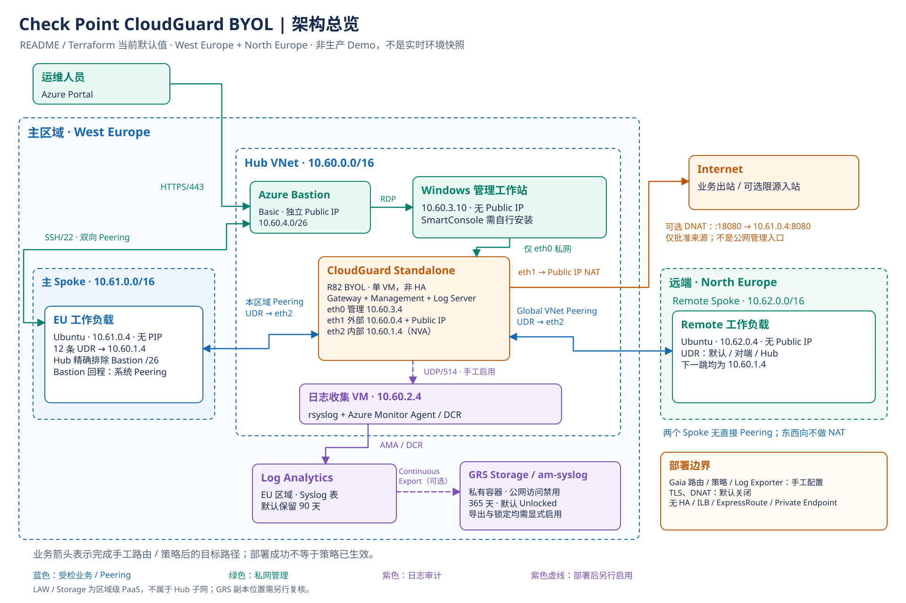
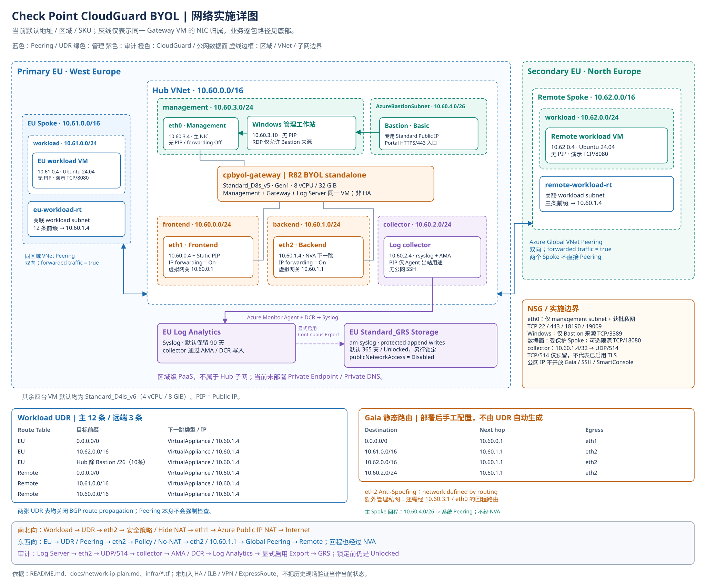

# 架构总览、网络实施与 Step-by-step 使用指南

本项目是一个 **Azure 双区域 Hub-Spoke + 三网卡单实例 Check Point CloudGuard BYOL Demo**。
它用同一台 VM 承载 Security Gateway、Management Server 和 Log Server；
不是三台 Check Point VM，也不是 HA 集群。

本文以 [README](../README.md) 为主，并对照当前 Terraform、[网络与 IP 规划](network-ip-plan.md)
和 [策略 runbook](policy-runbook.md)。图中使用 example 的默认值，不是实时 Azure 资源清单。
历史现场曾交换主、远端区域并使用双网卡或不同镜像，不能与当前图混用。

## 1. 两张图与打开方式

| 交付物 | 用途 | 预览 | 可编辑源文件 |
| --- | --- | --- | --- |
| 一页架构总览 | 汇报、讲解三个平面及项目边界；10 个主要对象，包括运维人员和 Internet | [SVG](diagrams/cloudguard-overview.svg) | [Excalidraw](diagrams/cloudguard-overview.excalidraw) |
| 网络实施详图 | 核对 5 台 VM、3 块 Gateway NIC、5 个 Hub 子网、主 12 + 远端 3 条 workload UDR 和 4 条 Gaia 路由 | [SVG](diagrams/cloudguard-network.svg) | [Excalidraw](diagrams/cloudguard-network.excalidraw) |
| 原有四页架构图 | 继续查阅资源、流量、安全策略和部署审计的分页面说明 | [原有预览](checkpoint-cloudguard-byol-test-architecture.svg) | [draw.io](checkpoint-cloudguard-byol-architecture.drawio) |

### Step 1：查看与分享

1. 点击下面的图，或用浏览器打开对应 `.svg` 文件。SVG 是矢量图，可以放大查看，不依赖外部图片服务。
2. 汇报时先用总览图；实施评审时放大详图下方的 UDR / Gaia 路由表。
3. 打印时选择横向、适合一页；网络详图建议使用 A3 或更大纸张。

### Step 2：编辑

1. 使用已安装的 Excalidraw 编辑器 / VS Code 扩展，或打开 [Excalidraw](https://excalidraw.com/)。
2. 通过 **Open / 打开** 加载 `.excalidraw` 文件；不是把 SVG 导入后当作可编辑节点。
3. 修改区域、地址、组件或连线。相同组件的文字和方框已分组，连接线绑定到对应方框。
4. 保存 `.excalidraw`，再导出 SVG，更新同名预览；只改其中一个文件会造成源图与预览不一致。
5. 如需沿用 draw.io，直接打开原有 `.drawio` 文件；两种编辑格式不是自动双向同步关系。

当前文件仅包含默认地址和通用资源名。加入客户真实资源、订阅信息后，应按客户资料处理；
使用获批的本地编辑器，不上传到未经批准的在线服务。

### 重新导出离线 HTML

修改本文或图源并更新 SVG 后，在仓库根目录用 Python 3 和 Pandoc 重新生成单文件 HTML：

```bash
python3 scripts/render-architecture-guide.py
python3 tests/validate-architecture-guide.py
```

导出器内嵌当前图像、SVG / Excalidraw / draw.io 下载内容和样式，不访问 Azure，
也不读取 state、私钥或客户 tfvars。其余参考文档链接指向 GitHub，离线时不可打开。
仓库静态检查会核对图片与源文件字节、可编辑图文字、链接和代码块，避免只更新 Markdown 而遗留旧 HTML。

## 2. 一页架构总览

[](diagrams/cloudguard-overview.svg)

读图时分清三个平面：

| 平面 | 主要路径 | 解决的问题 |
| --- | --- | --- |
| 业务数据面 | Workload → UDR → `eth2` → CloudGuard 检查；公网出站再经 `eth1` | 互联网出站和跨区域东西向流量集中执行安全策略 |
| 私网管理面 | 管理员 → Azure Bastion → Windows `10.60.3.10` → `eth0 10.60.3.4` | 不把 Gaia、SSH、SmartConsole 暴露到 Gateway Public IP |
| 主 workload 管理 | Azure Bastion ↔ Hub–主 Spoke Peering ↔ Ubuntu `10.61.0.4:22` | 主表精确排除 Bastion 子网，避免管理回程绕入 NVA；不经 Windows 中转 |
| 日志审计面 | Log Server → collector → AMA / DCR → Log Analytics → 可选 Continuous Export → GRS Storage | 集中查询日志，并在显式配置后提供长期不可变留存 |

**蓝色业务连线表示完成路由、NAT 和策略配置后的目标路径，不表示 `deploy.sh` 已使这些功能生效。**
紫色虚线表示需要部署后另行启用的 Log Exporter 或 Continuous Export。

Log Analytics 和 Storage 是主区域的 PaaS 资源，不是在 Hub 子网内运行的 VM。
`am-syslog` 是私有容器、Storage 公网访问被禁用，但当前模板**没有创建 Private Endpoint / Private DNS**。
GRS 的异地副本由 Azure 管理，不是在 Remote Spoke 内另建一台存储服务器。

### 默认部署与后续配置的分界

| 能力 / 资源 | 默认 `deploy.sh` 结束时 | 后续动作 |
| --- | --- | --- |
| VNet、子网、Peering、UDR、NSG | 由 Terraform 创建 | 核对 effective routes |
| 三网卡 CloudGuard、两台 workload、collector | 由 Terraform 创建 | CloudGuard 仍需 BYOL 和安全配置 |
| Windows 与 Basic Bastion | 默认创建，可通过参数关闭 | 经批准安装匹配版本的 SmartConsole |
| Gaia 业务静态路由 | 部署脚本不配置 | 在 Gaia 手工确认 / 创建 |
| Access Control、Geo、Application / URL、NAT | 部署脚本不配置 | SmartConsole 创建、Publish、Install Policy |
| HTTPS Inspection / 可选 DNAT | 默认关闭 | 另行审批并配置；TLS 还需客户端信任 CA |
| collector、AMA、DCR、Log Analytics | 由 Terraform 创建 | 手工配置 Check Point Log Exporter 后确认真实日志 |
| Continuous Data Export | 默认不创建 | 显式执行 `enable-audit-export.sh` |
| `am-syslog` 不可变策略 | 365 天、`Unlocked` | 确认后单独执行不可逆锁定 |

## 3. 网络实施详图

[](diagrams/cloudguard-network.svg)

灰线只表示 **NIC 属于同一台 Gateway VM**，不是第四类流量。Peering 连线连接 VNet 边界；
实际业务仍由 UDR 引流到 NVA，不能把 Peering 本身理解为防火墙检查。

### 3.1 地址与职责

| 位置 | 网段 / 地址 | 职责 |
| --- | --- | --- |
| Hub / management | `10.60.3.0/24` | `eth0 10.60.3.4` 与 Windows `10.60.3.10`；二者均无 Public IP |
| Hub / frontend | `10.60.0.0/24` | `eth1 10.60.0.4`，绑定 Gateway 的 Standard Static Public IP |
| Hub / backend | `10.60.1.0/24` | `eth2 10.60.1.4`，工作负载的 NVA 下一跳 |
| Hub / collector | `10.60.2.0/24` | rsyslog + AMA VM `10.60.2.4`；其独立 Public IP 仅用于 Agent 初始出站 |
| Hub / AzureBastionSubnet | `10.60.4.0/26` | Basic Bastion，有独立 Public IP；RDP 到 Windows，或通过 Peering SSH 到主 workload |
| West Europe 主 Spoke | VNet `10.61.0.0/16`；workload subnet `10.61.0.0/24` | Ubuntu VM `10.61.0.4`，无 Public IP |
| North Europe 远端 Spoke | VNet `10.62.0.0/16`；workload subnet `10.62.0.0/24` | Ubuntu VM `10.62.0.4`，无 Public IP |

`eth0` 是 Azure primary NIC，IP forwarding 关闭；`eth1` / `eth2` 开启 IP forwarding。
默认 Gateway 为 Gen1 `Standard_D8s_v5`，其余四台 VM 为 `Standard_D4ls_v6`。
不能把当前 Gen1 Check Point 镜像直接换到只支持 Gen2 的 Dv6。

### 3.2 两层路由缺一不可

**Azure UDR：把工作负载的包送到 Check Point。**

| 关联的 workload 子网 | 目标前缀 | Next hop |
| --- | --- | --- |
| 主 Spoke，2 条业务路由 | `0.0.0.0/0`、`10.62.0.0/16` | `VirtualAppliance 10.60.1.4` |
| 主 Spoke，10 条 Hub 补集路由 | Hub `/16` 精确减去 Bastion `10.60.4.0/26`，见下表 | `VirtualAppliance 10.60.1.4` |
| 远端 Spoke | `0.0.0.0/0`、`10.61.0.0/16`、`10.60.0.0/16` | `VirtualAppliance 10.60.1.4` |

两张 Route Table 均关闭 BGP route propagation。两个 Spoke 分别与 Hub 双向 Peering，
并开启 `allow_forwarded_traffic`；Spoke 之间没有直接 Peering。

**主表默认共 12 条、远端仍为 3 条。** 主表的 10 条 Hub 补集如下，下一跳全部保持
`VirtualAppliance 10.60.1.4`：

| 主表路由名 | 目标前缀 |
| --- | --- |
| `hub-inspect-10-60-0-0-22` | `10.60.0.0/22` |
| `hub-inspect-10-60-4-64-26` | `10.60.4.64/26` |
| `hub-inspect-10-60-4-128-25` | `10.60.4.128/25` |
| `hub-inspect-10-60-5-0-24` | `10.60.5.0/24` |
| `hub-inspect-10-60-6-0-23` | `10.60.6.0/23` |
| `hub-inspect-10-60-8-0-21` | `10.60.8.0/21` |
| `hub-inspect-10-60-16-0-20` | `10.60.16.0/20` |
| `hub-inspect-10-60-32-0-19` | `10.60.32.0/19` |
| `hub-inspect-10-60-64-0-18` | `10.60.64.0/18` |
| `hub-inspect-10-60-128-0-17` | `10.60.128.0/17` |

主 workload 返回 Bastion 时，没有匹配的 Hub UDR，因而走系统 Hub Peering `/16`，
其优先级高于 NVA 默认 `/0`；其余 65,472 个 Hub 地址仍受检。
不要同时保留旧主表 `hub-via-checkpoint 10.60.0.0/16`，也不要只缩成 `/22`。
不创建 `Virtual network peering` 类型的 UDR，不给 Bastion 子网绑定路由表。
这是目标地址例外，对所有协议生效，不替代 NSG、guest firewall 或 SSH 认证。

Terraform 按配置的 Hub/Bastion CIDR 自动计算补集。关闭
`enable_management_workstation` 时，主表恢复原 Hub 路由、共 3 条；远端始终不变。
上面的 15 条只统计两张 workload 表，不包含 vendored 模块的 Gateway frontend/backend 路由。

**旧主表的 Portal 更改顺序：** 先保存路由和子网关联；新增上述 10 条（此时含旧 `/16` 共 13 条）；
核对后删除旧 `hub-via-checkpoint /16`（剩 12 条）；再检查 effective routes、TCP/22 和实际 SSH。
回滚时先恢复旧 `/16`，再删这 10 条，保留默认和对端路由。完整步骤见
[网络规划的迁移说明](network-ip-plan.md#bastion-回程修正与迁移)。
已手工改好的环境应在原 state/tfvars 的部署目录审查新代码计划，不要重复增删或用空 state 重建；
本次修正本身不需要替换 VM。密码、NSG、公网 IP、远端表和 Gaia 路由不属于此次变更。

**Gaia 静态路由：决定 Check Point 收到并检查包以后从哪里发出。**

| Destination | Next hop | Interface |
| --- | --- | --- |
| `0.0.0.0/0` | `10.60.0.1` | `eth1` |
| `10.61.0.0/16` | `10.60.1.1` | `eth2` |
| `10.62.0.0/16` | `10.60.1.1` | `eth2` |
| `10.60.2.0/24` | `10.60.1.1` | `eth2` |

Azure UDR 不会自动写入 Gaia。增加 `management_cidrs` 时，还需要经
`10.60.3.1 / eth0` 返回这些管理私网的路由。

### 3.3 业务与管理路径

| 场景 | 顺序 |
| --- | --- |
| 互联网出站 | Workload → UDR → `eth2` → Access Control / Hide NAT → `eth1` → Azure Public IP NAT → Internet |
| 跨区域东西向 | `10.61.0.4` → UDR / Peering → `eth2` → Policy / No-NAT → `eth2` / Gaia route → Global Peering → `10.62.0.4`；回程也经过 NVA |
| 可选 DNAT | 批准来源 → Gateway Public IP `:18080` → `eth1` → Access + DNAT → `eth2` → `10.61.0.4:8080` |
| Check Point 日志 | 同机 Log Server → Gaia collector 路由 / `eth2` → `10.60.2.4:514/UDP` → AMA / DCR → Log Analytics → 可选导出 |
| 主 workload 的 Bastion SSH | Bastion → Hub–主 Spoke Peering → `10.61.0.4:22`；回程走系统 Peering，不经过 CloudGuard |

东西向先匹配 **No-NAT**，保留 workload 原始源地址；公网出站再匹配 Hide NAT。
日志使用 UDP/514，不是已加密的 TLS 链路；collector NSG 中的 TCP/514 仅为后续预留。

## 4. 从零使用：Step by step

主线采用 **默认 R82 + 人工配置 Gaia / SmartConsole**。已有环境应先核对实际 outputs，
然后从 Step 4 继续，不要重复创建或覆盖已有 state / tfvars。

| 执行位置 | 执行什么 |
| --- | --- |
| 部署机的 Bash / WSL | `preflight.sh`、`plan.sh`、`deploy.sh`、日志查询和审计导出；保留原 Terraform state |
| Bastion 内的 Windows | PowerShell 连通性检查、Gaia Portal、SmartConsole |
| 已授权的管理私网执行机 | 可选策略自动化、需要 Gaia SSH 的独立验证；须具备工具、outputs 与匹配的 SSH 私钥 |
| Gaia Expert shell | 经授权配置 / 查看 Log Exporter；不要在这里运行本地部署脚本 |

Windows 默认只提供操作系统，不自动安装 SmartConsole、WSL 或本指南所需 CLI。
若把 Windows 配置成私网脚本执行机，需要经批准准备 Bash / WSL 及相关工具；
也可使用已获准接入管理私网的运维机，但后者不是本 Demo 默认新增的资源。
Bastion 的浏览器 RDP 会话不等于给管理员本地电脑建立了到 `10.60.3.4` 的路由。

### Step 1：准备工具、订阅与许可

在部署机准备 Terraform `>= 1.9`、Azure CLI、Bash、`jq`、OpenSSL、Python 3。

```bash
az login
az account list --output table
```

选定客户批准的订阅，确保有部署及接受 Marketplace 条款的权限，且商务市场允许购买该
Check Point Offer。示例 West Europe / North Europe 是资源区域，不会绕过订阅的商务市场限制。
BYOL 及所需 Software Blade 授权需另行准备，许可证和激活信息不写入仓库或 Terraform。

### Step 2：创建参数文件

在仓库根目录操作。以下复制命令仅用于文件尚不存在的新环境，**不要覆盖已有客户参数**：

```bash
cp configs/demo.tfvars.example configs/demo.tfvars
```

至少修改订阅 ID 和强密码，并确认以下默认选择适合本次 Demo：

```hcl
subscription_id           = "<SUBSCRIPTION_ID>"
resource_group_name       = "rg-checkpoint-byol-demo"
prefix                    = "cpbyol"
checkpoint_admin_password = "<STRONG_GAIA_ADMIN_PASSWORD>"

location                      = "westeurope"
remote_location               = "northeurope"
checkpoint_os_version         = "R82"
checkpoint_vm_size            = "Standard_D8s_v5"
enable_management_workstation = true

skip_policy_configuration = true
enable_tls_inspection     = false
enable_inbound_demo       = false
```

保留 example 中其他配置。图中固定地址来自这些参数的默认值；修改 CIDR 后应以 outputs
替换本文示例 IP。`management_cidrs` 只用于额外获批私网，不能填写 `0.0.0.0/0`。

`configs/demo.tfvars`、`.local/`、Terraform state、私钥和计划文件均可能包含敏感信息，
不要提交。生产使用加密、受 RBAC 和锁保护的远程 backend。

### Step 3：预检、检查计划，再部署基础设施

```bash
./scripts/preflight.sh --var-file configs/demo.tfvars
./scripts/plan.sh --var-file configs/demo.tfvars
terraform -chdir=infra show -no-color "$(pwd)/.local/plan.tfplan"
```

确认计划中的订阅、区域、Resource Group、五台 VM、三块 Gateway NIC、Bastion 和日志资源。
预检会准备项目专用 SSH key 和密码 hash，但不会在 Gaia 中创建业务策略。

**下一条命令会接受所需 Marketplace 条款、重新生成计划并自动 apply，开始产生 Azure 费用。**
确认具备授权且目标正确后再执行；首次演示不要附加 `--lock-worm`。

```bash
./scripts/deploy.sh --var-file configs/demo.tfvars
```

成功结束会保存 `.local/latest-deployment-outputs.json`。这只表示基础设施阶段结束，
不表示 BYOL、SmartConsole、Gaia 静态路由、策略、TLS 或 Log Exporter 已配置。
当前三网卡设计不提供旧双网卡 state 的原地迁移；双网卡旧环境应按 README 使用新 Resource Group 重建。
已是三网卡的环境仅修正 Bastion 路由时，不需要因此重建 VM；先在原 state 上评审计划。

### Step 4：核对交接地址

在原部署机运行：

```bash
terraform -chdir=infra output -raw checkpoint_management_private_ip
terraform -chdir=infra output -raw checkpoint_frontend_private_ip
terraform -chdir=infra output -raw checkpoint_backend_private_ip
terraform -chdir=infra output -raw windows_client_private_ip
terraform -chdir=infra output -raw bastion_host_name
terraform -chdir=infra output -raw windows_client_admin_username
```

默认应分别看到 `10.60.3.4`、`10.60.0.4`、`10.60.1.4`、`10.60.3.10` 以及 Bastion 名称、
Windows 用户名。输出文件是后续验证的依据，不能手工改造成“期望结果”。

### Step 5：通过 Bastion 进入私网管理

1. 在 Azure Portal 打开本次部署的 Bastion，选择 Windows 管理工作站，使用 RDP 连接。
2. 默认 Windows 用户名为 `azureadmin`，密码复用 `checkpoint_admin_password`；
   仅显式设置 `windows_client_admin_password` 时使用独立密码。
3. 在 Windows PowerShell 中检查 Gaia 私网端口；若修改过地址，替换下面的默认值：

   ```powershell
   Test-NetConnection 10.60.3.4 -Port 443
   ```

4. 在 Windows 浏览器访问 `https://10.60.3.4`，使用 Gaia `admin` 登录。
   核对环境和测试证书身份；生产应使用可信证书，不把忽略证书告警作为常规做法。
5. 经批准安装与 Gateway Gaia 版本匹配的 SmartConsole，连接同一个管理私网 IP。

成功条件是 Windows 能进入 Gaia，而不是管理员电脑能访问 Gateway 公网的 443 端口。
后者应被阻止。Windows NSG 只允许 Bastion 子网到 TCP/3389；
Gateway 管理 NIC 只允许管理私网到 TCP/22、443、18190、19009。

**登录主 Spoke Ubuntu：** 不进入 Windows 中转，在 Portal 打开 `cpbyol-eu-workload`
→ **Connect → Bastion**，协议 **SSH**、端口 **22**、用户名默认 **`azureuser`**。
认证选择 **SSH Private Key from Local File**，使用原部署机 `.local/checkpoint-demo-ssh`
或与 `admin_ssh_public_key` 匹配的私钥，不是 `.pub` 文件。VM 无需公网 IP。

Bastion 的 TCP 检查显示 `Reachable` 只代表网络端口可达，不代表凭据正确。
模板默认 `disable_password_authentication=true`；Bastion 虽支持 VM Password，
也必须由管理员另行配置 Linux 用户密码及实际 SSH 密码认证，不能复用 Gaia/Windows 密码来假定可登录。
本次修正不会启用密码、添加公网 SSH Allow、收紧成 Bastion-only，也不会修改远端表。

### Step 6：在 Gaia 配置网络与路由

1. 核对 `eth0=Management`、`eth1=External`、`eth2=Internal`，地址对应详图。
2. 在 Gaia Portal 确认默认路由从 `eth1` 经 `10.60.0.1` 发出；不要因 `eth0` 是 primary NIC
   就把业务默认出口设到管理网。
3. 创建 / 核对第 3.2 节的两个 Spoke 路由和 collector 子网路由，下一跳均为 `10.60.1.1`。
4. 如追加了 `management_cidrs`，为其配置经管理网 `10.60.3.1 / eth0` 的回程路由。
5. 保存配置。在 SmartConsole Gateway topology 中把 `eth2` Anti-Spoofing 设为
   `network defined by routing`，使其识别后端受保护网段。

对于经过 NVA 的业务流量，只改 Azure UDR、不改 Gaia 路由，无法保证往返链路正确；
上面的 Bastion 直连主 workload 是独立管理例外，不依赖 Gaia 转发。

### Step 7：激活 BYOL，配置策略与 NAT

1. 按 Check Point 授权流程激活 BYOL，确认 Firewall、Application Control、URL Filtering
   及本次需要的其他 Blade 授权。
2. 创建两个受保护 Spoke network objects、workload host、collector 和所需服务对象。
   东西向演示服务为 TCP/8080，仓库使用内置 `HTTP_proxy` 对象。
3. 按 [策略 runbook](policy-runbook.md#access-control-规则顺序) 设置规则顺序：
   Gateway 自身所需服务、受限管理、可选限源 DNAT 例外、双向 Geo、
   Domain / URL / Application 阻断、东西向 Web、Web / DNS 出站，最后 Cleanup Drop。
4. NAT 中先配置两个受保护网络之间的 **No-NAT**，再配置公网出站 **Hide NAT**。
   不要对东西向流量做统一源地址转换，否则无法保留 `10.61.0.4` / `10.62.0.4`。
5. 开启相应日志记录，执行 **Publish**，再对该 standalone Gateway **Install Policy**。
6. 在 SmartConsole 中核对已安装策略及日志，不以“对象创建成功”代替策略安装成功。

默认不开放入站服务。确需 DNAT 演示时，必须另行设置 `enable_inbound_demo=true` 和批准来源
`inbound_demo_source_cidr`，检查 / 应用 Terraform 计划，再同步配置 Check Point Access Rule、
DNAT 与主 workload NSG。目标为 `Public IP:18080 → 10.61.0.4:8080`，不是开放管理端口。
该窄例外位于 Geo Inbound 之前，必须限制来源与服务。

### Step 8：可选配置 HTTPS Inspection

不需要 TLS 解密时跳过本步，保持 `enable_tls_inspection=false`；T07 应为 `SKIP`。
**只修改 Terraform 开关不会让手工管理的防火墙自动启用 TLS。**

1. 取得解密范围、例外站点和证书分发的批准，确认许可。
2. 在 SmartConsole 的 Gateway **HTTPS Inspection** 中创建 / 导入 Outbound CA，
   启用 HTTPS Inspection，并导出只含公钥的 PEM / DER 证书。
3. 在 package 中启用 Access Control & HTTPS Inspection，先设批准的 Bypass，再设受保护
   网络的 outbound Inspect rule；Publish 并 Install Policy。
4. 经批准将公钥 CA 安装到两台 Ubuntu workload 的信任库；CA 私钥和 P12 不离开受控管理环境。
   例如将 PEM 公钥证书放到各 VM 的 `/usr/local/share/ca-certificates/cloudguard-demo.crt`，
   再在各 VM 运行 `sudo update-ca-certificates`。
5. 为使验证读取到实际启用状态，在本次 tfvars 设置 `enable_tls_inspection=true`。
   R81 还需设置 `r81_tls_manually_configured=true`；不要在 R82 设置这个 R81 专用字段。
   在原部署机检查 / 应用计划并重新保存 outputs，保持其与实际配置一致：

   ```bash
   ./scripts/plan.sh --var-file configs/demo.tfvars
   terraform -chdir=infra apply -input=false "$(pwd)/.local/plan.tfplan"
   terraform -chdir=infra output -json > .local/latest-deployment-outputs.json
   chmod 600 .local/latest-deployment-outputs.json
   ```

6. Step 11 验证时额外传入 `--ca-file <PUBLIC_CA_FILE>`，核对实际网站叶子证书 issuer，
   不能只检查 CA 文件或策略开关存在。

R81 GA API 1.7 不支持本仓库完整自动创建该 CA / Gateway setting 的流程；
详细版本差异与操作见 [R81 HTTPS Inspection / T07](post-deployment-validation.md#4-r81-https-inspection--t07)。

### Step 9：启用 Log Exporter，确认真实防火墙日志

在经授权的 Gaia Expert shell 中，先检查同名 exporter 是否已经存在：

```bash
cp_log_export show name azure-monitor
```

仅在确认不存在时创建；下面的 collector IP 是默认值：

```bash
cp_log_export add \
  name azure-monitor \
  target-server 10.60.2.4 \
  target-port 514 \
  protocol udp \
  format generic \
  read-mode semi-unified \
  --apply-now
```

若同名 exporter 已存在，应核对配置，并使用 `cp_log_export set` 更新，而不是重复 `add`。

```bash
cp_log_export status
```

确认 `azure-monitor` 为 Running，Gaia collector 路由走 `eth2`。collector NSG 的显式
syslog Allow rule 使用源 `10.60.1.4/32`；核对实际出口和源地址，而不只检查 exporter 进程。

在原部署机查询：

```bash
./scripts/query-logs.sh --hours 2
```

确认 Log Analytics 出现本次 Gateway 的真实 `Accept` / `Drop` 或策略日志。
只有 bootstrap `logger` 消息不能证明 Check Point 审计已经连通。

### Step 10：显式启用持续审计导出

在保留 Terraform state 的原部署机执行：

```bash
./scripts/enable-audit-export.sh --var-file configs/demo.tfvars
```

该脚本不是只读查询：它通过 collector 发送 bootstrap syslog，等待 `Syslog` 表可查询，
再写入本地审计参数并应用 Terraform 配置，创建 Continuous Data Export。
默认每 30 秒查询一次，最多等待 30 分钟；失败时按错误检查 collector VM、AMA、DCR 和查询权限。

核对源为本次 Log Analytics `Syslog` 表、目标为同主区域的 GRS Storage / `am-syslog`。
此时仍保持 `Unlocked`。查看真实 blob 需要另外具备获批的网络路径和权限；
“私有容器”不代表本仓库已经为审计人员创建了 Private Endpoint。

### Step 11：从私网执行独立验证

先按 [独立验证前置条件](post-deployment-validation.md#2-测试机前置条件) 准备执行机：
工具齐全、Azure CLI 已登录、可访问管理私网，并安全持有部署匹配的 SSH 私钥和最新 outputs。
不要把 state / 密钥 / outputs 放入公共仓库。需要五台 VM 运行，相关 VM Agent 就绪。

在该执行机的仓库根目录运行，默认示例为 R82；若实际是 R81 / R8210，使用对应版本：

```bash
OUTPUTS=.local/latest-deployment-outputs.json
STAMP="$(date -u +%Y%m%dT%H%M%SZ)"
OUT="evidence/${STAMP}-R82-stage2"

./scripts/validate-existing.sh \
  --outputs-file "$OUTPUTS" \
  --expected-release R82 \
  --output-dir "$OUT"
```

启用了 Step 8 的 TLS 时，在同一次命令中增加 `--ca-file <PUBLIC_CA_FILE>`。
每次使用新的输出目录；不要在同一目录覆盖已有报告。

验证不创建 Firewall policy，但会使用 SSH / Azure Run Command 执行检查、产生真实测试流量与日志。
它与部署、配置阶段是独立的。主要检查：

| 检查 | 通过条件 |
| --- | --- |
| T01 / T02 | 两个 workload NIC 的 Active 默认路由都指向 `VirtualAppliance 10.60.1.4` |
| T03 / T16 | 跨区域 TCP/8080 可达，且远端观察到原始 workload 源 IP |
| T04–T08 | 放行、阻断、Geo / Application 及已启用的 TLS 行为符合策略 |
| T09 / T10 | Log Exporter Running，Log Analytics 有真实防火墙日志 |
| T11 | 不可变策略保留期与输出一致；脚本不据此判定是否已 `Locked`，状态需单独核对 |
| T17 | 三网卡管理隔离与 NSG 绑定符合预期 |

默认 TLS、DNAT 未启用时，T07、T13 的 `SKIP` 是正常的，不能声称这两项已通过。
`FAIL` 或 `PENDING_INGESTION` 不能当作完成。未先配置策略 / 路由 / Log Exporter 的基础设施，
也不应预期完整业务测试全部通过。

打开 `$OUT/report.html` 阅读客户报告，或查看：

```bash
jq '{overallStatus, results: [.results[] | {id,status}]}' "$OUT/summary.json"
```

证据目录时间戳使用 UTC，换算到 UTC+8 时加 8 小时。报告包含资源和策略信息，应按敏感资料保存。

### Step 12：仅在确认后锁定 WORM

默认演示保持 `Unlocked`。先确认日志导出正常、保留天数正确、GRS 数据位置符合要求，
并取得客户对不可逆锁定及销毁影响的明确确认。

只有完成确认后，才由授权管理员在原部署机执行：

```bash
./scripts/lock-worm.sh --yes
```

锁定后在原部署机重新读取状态，不使用锁定前的旧报告作为证据：

```bash
az storage container immutability-policy show \
  --subscription "$(terraform -chdir=infra output -raw subscription_id)" \
  --resource-group "$(terraform -chdir=infra output -raw resource_group_name)" \
  --account-name "$(terraform -chdir=infra output -raw audit_storage_account_name)" \
  --container-name "$(terraform -chdir=infra output -raw audit_container_name)" \
  --output json
```

应看到 `state=Locked`；**T11 PASS 本身只证明保留天数匹配，不证明已锁定**。
锁定后不能恢复 `Unlocked` 或缩短保留期；
`terraform destroy` 也不能绕过保留期内的删除保护。不要把本步合并到首次试部署。

### Step 13：演示结束后的处理

需要保留现场就不要运行销毁脚本；VM 停机也不代表 Bastion、Public IP、Storage 等费用全部停止。
获准删除未受锁定保护的演示环境时，按
[README 的销毁步骤](../README.md#8-销毁) 处理，并先核对订阅、Resource Group 和 collector VM Agent。
该流程永久删除 Log Analytics，不保留默认 soft-delete 副本，因此不放入本页主执行命令块。

## 5. 可选：使用保留自动化，而非手工配置

这是一条替代配置路径，不是默认部署步骤。确认允许脚本修改 Gateway 后，才能在管理私网执行机运行：

```bash
CHECKPOINT_SKIP_POLICY_CONFIGURATION=false \
CHECKPOINT_TRANSPORT=ssh \
./scripts/configure-policy.sh \
  --outputs-file .local/latest-deployment-outputs.json
```

该模式会配置 Gaia / Log Exporter，并重建 `CloudGuard Demo - ` 前缀的演示规则、
NAT 和相关对象。先核对输入与客户已存在规则，再执行；不能因为 `deploy.sh` 成功就假定它已运行。
R81 的 TLS 仍遵循 SmartConsole bootstrap 限制。完整语义见 [策略 runbook](policy-runbook.md)。

## 6. 实施时最容易画错、用错的地方

| 误解 | 正确理解 |
| --- | --- |
| management / gateway / log 是三台服务器 | 当前三种角色在同一台 standalone VM 上 |
| `eth0` 是公网接口 | 当前 `eth0` 是私网管理；公网数据面绑定 `eth1` |
| 有 Peering 就等于经过防火墙 | 需要 workload UDR、正确 Gaia 路由、NAT 和已安装策略共同完成 |
| 主表仍应保留 Hub `/16` UDR | 开启 Bastion 时必须换成精确补集，否则 Bastion 回程仍被送入 NVA；远端表维持原状 |
| Bastion `Reachable` 就能用任意 VM Password 登录 | TCP 可达不代表认证成功；Ubuntu 默认密钥认证，本次不启用密码 |
| 所有 VM 互联网流量都经 CloudGuard | 强制 UDR 的是两个 workload 子网；不能外推到整个 Hub，collector 还有独立出站 Public IP |
| Log Analytics / Storage 位于 Hub 子网 | 它们是区域级 PaaS；当前没有 Private Endpoint |
| 有 Storage 私有容器就等于 Locked WORM | 默认不可变策略为 `Unlocked`，另行锁定才达到 Locked 状态 |
| 整套安全能力已经由 Terraform 自动配置 | 默认只部署基础设施，安全功能需要后续显式配置 |
| 这是已经验证的生产 HA / ExpressRoute 架构 | 当前为单机 Demo + Global VNet Peering，不包含 HA、ILB、ExpressRoute 或 VPN |

生产化需要独立评审 HA / Gateway 扩展、管理服务器拆分、企业 CA 与解密例外、
TCP/TLS 日志、审计访问网络、EU 数据位置及长期保留要求；这些不应画成当前已部署组件。
